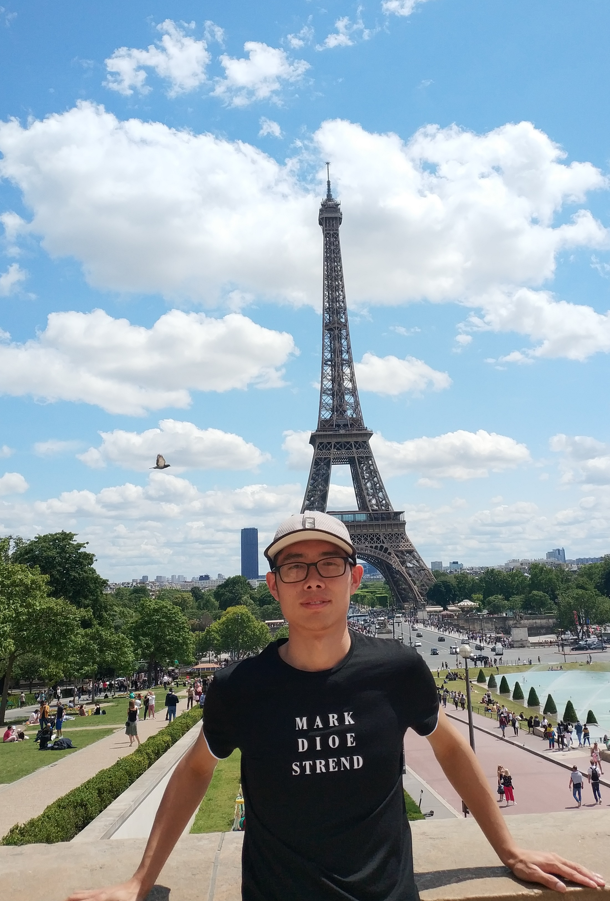

## Welcome to my homepage!([**中文主页**](Chinese.md))
 Qi Wang (Ph.D, Special-Term Professor)  
 is working with State Key Laboratory of Public Big Data, [Guizhou University](http://www.gzu.edu.cn/en/), China  

Mobile: +86-15603055556  
Email: qiwang@gzu.edu.cn   
Google Scholar: [Qi.Wang](https://scholar.google.com/citations?user=jUcEacsAAAAJ&hl=zh-CN)   
Address: Room 718, Chonghou Building of West Campus, Guizhou University, Huaxi Distriict, Guiyang City, Guizhou Province, China (550025)
## catalogue	
[Education](#jump1)    
[Research Experience](#jump2)  
[Research Interests](#jump3)  
[Publications](#jump4)  
[Porjects](#jump5)  
[Patents](#jump6)  
[Honors & Awards](#jump7)
## Education

2018.07 ~ 2021.02：Ph.D., Engineering Technology, Hasselt University  
2015.09 ~ 2020.12：Ph.D., Computer Application Engineering, Guangdong University of Technology  
2011.09 ~ 2015.06：B.E., Electronic Information Engineering, Northwest University for Nationalities

## Research Experience

2018.07 ~ 2021.02: Hasselt University, supervisor: [Luc Claesen](https://www.uhasselt.be/fiche?voornaam=luc&naam=claesen#fiche)  
2019.01 ~ 2019.04: JD AI Lab, supervisor: [Tao mei](http://taomei.me/), [Wu Liu](http://liuwu.weebly.com/)  
2015.09 ~ 2020.12: Guangdong University of Technology, supervisor: [Wenyin Liu](http://www.wislab.cn/liuwy/cv.htm)，[Liang Lei](https://yzw.gdut.edu.cn/info/1124/4546.htm)

## Research Interests

Knowledge Discovery and Data Mining; Image analysis and understanding; Few-shot learning; Fine-grained analysis; Image captioning; Adversarial attack; Obiect detection; Image segmentation; Multi-view stereo; Depth estimation

## Publications

1. **Qi Wang**, Hongyu Deng, Xue Wu, Zhenguo Yang, Yun Liu, Yazhou Wang, Gefei Hao. LCM-Captioner: A Lightweight Text-based Image Captioning method with Collaborative Mechanism between Vision and Text. Neural Networks, 2023.03. 
2. Huizhou Zhou, Haoliang Zhao, **Qi Wang***, Gefei Hao, Liang Lei. Miper-MVS: Multi-scale Itearative Probability Estimation with Refinement for Efficient Multi-View Stereo. Neural Networks,2023.03. 
3. Yuling Chen, Hao Yang, Xuewei Wang, **Qi Wang***, and Huiyu Zhou. 2023. GLH: From Global to Local Gradient Attacks with High-Frequency Momentum Guidance for Object Detection. Entropy 25, no. 3: 461.
4. Wu Xue, Deng Hongyu, **Wang Qi***, Gao YangYang, Lei Liang, Hao Ge-Fei. Meta-learning Shows Great Potential in Plant Diseases Recognition Under Few Available Samples. The Plant Journal. 2023, 03.
5. Huang, Yang, Yuling Chen, Xuewei Wang, Jing Yang, and **Qi Wang***. Promoting Adversarial Transferability via Dual-Sampling Variance Aggregation and Feature Heterogeneity Attacks. Electronics. 2023; 12(3):767.
6. Zhou, Huizhou, Haoliang Zhao, **Qi Wang***, Liang Lei, Gefei Hao, Yusheng Xu, and Zhen Ye. EMO-MVS: Error-Aware Multi-Scale Iterative Variable Optimizer for Efficient Multi-View Stereo. Remote Sensing, 2022, 14(23):6085. 
7. YANG Jing, LI Bin, LI Shaobo, Qi Wang, YU Liya, HU Jianjun, YUAN Kun. Brain-inspired Continuous Learning: Technology, Application and Future. Journal of Electronics & Information Technology, 2022, 44(5): 1865-1878.
8. **Qi Wang**, Jinxiang Lai, Luc Claesen, Zhengguo Yang, Liang lei, Wenyin Liu. A Novel Feature Representation: Aggregating Convolution Kernels for Image Retrieval. Neural Networks, 2020, 130: 1-10. 
9. **Qi Wang**, Xinchen Liu, Wu Liu, Anan Liu, Wenyin Liu, Tao Mei. MetaSearch: Incremental Product Search via Deep Meta-learning. IEEE Transactions on Image Processing, 2020, 29: 7549-7564.
10. **Qi Wang**, Jinxiang Lai, Zhenguo Yang, Xu Kai, Kan Peipei, Liu Wenyin, Lei Liang. Improving Cross-dimensional Weighting Pooling with Multi-scale Feature Fusion for Image Retrieval. Neurocomputing, 2019, 363: 17-26
11. **Qi Wang**, Jingxiang Lai, et al. Beauty Product Image Retrieval Based on Multi-Feature Fusion and Feature Aggregation. In Proceedings of the 26th ACM international conference on Multimedia, 2018, pp. 2063-2067.
12. **Qi Wang**, Liang Lei, Jingxing Lai, et al. Theory Research of Glare Reduction Based on the Fresnel Principle. Optik, 2017, 145: 106-112. 
13. Zhenguo Yang, Qing Li, Haoran Xie, **Qi Wang**, Wenyin Liu. Learning Representation from Multiple Media Domains for Enhanced Event Discovery. Pattern Recognition, 2021, 110:107640.  
14. Kai Xu, **Qi Wang**, et al. Biomedical Named Entity Recognition Based on Dictionary Attention GRU network. Computer Applications and Software, 2020, 37(5). 
15. K. Xu, Z. Yang, P. Kang, **Q. Wang**, and W. Liu. Document-Level Attention-Based BiLSTM-CRF Incorporating Disease Dictionary for Disease Named Entity Recognition. Computers in Biology and Medicine, vol. 108, pp. 122–132, 2019. 

## Porjects  

1. PI, Wang Qi, Natural Science Foundation of Guizhou Provincial Department of Science and Technology, 2022.04-2025.04, Research on fine-grained identification of tea tree leaf image diseases (100,000 RMB), Qiankehe Foundation-ZK [2022] General 108. Ongoing    
2. PI, Wang Qi, National Natural Science Foundation of China, 2022.01-2025.12, Theory and Research on Discrete Representation of Image Big Data (360,000 RMB), No. 62162008. Ongoing   
3. PI, Wang Qi, Guizhou University Cultivation Project, 2021.09-2024.9, Theoretical Research on Big Data Based on Plant Disease Images (55,000 RMB), No.20210042. Ongoing   
4. PI, Wang Qi, Special Gang Project of Guizhou University, 2021.06-2024.05, Research on Fine-grained Commodity Recognition with Small Samples (400,000 RMB), No. X2021227, Principal. Ongoing   
5. PI, Qi Wang, Belgium International Bilateral Scientific Cooperation Project-BOF 2020, 2020.01.01-2020.12.30, Deep Learning Content-Based Few-Shot Product Image Retrieval Algorithms and Architectures (15,900€), No. BOF20BL01. completed.  

## Patents

1.	Video key frame extraction method, system, equipment and storage media; 2018.05.28, CN201810523467.
2.	A target monitoring method, system, equipment and storage media; 2018.05.28, CN201810522083.
3.	A method, device and system for detecting the internal components of an object; 2017.09.07, CN2017108007464.
4.	A laser marking system and a laser marking method for on-line visual guidance; 2017.08.24, CN2017107367392.
5.	A flight marking system and control method based on general microscope and visual speed measurement; 2017.08.24, CN2017107361042.
6.	Automatic measurement system and measurement method based on feature point matching; 2016.06.08, CN2016104071109.
7.	3D reconstruction system and its method for multiscale biaxial rotating laser images; 2015.12.22, CN201510980774X.

## Honors & Awards

1.	JD AI STAR INTERN. Time: 03/2019
2.	National college students photoelectric design competition: 
	Second place at school level and Third prize at national level. Time:5/2016
3.	The National information technology application level competition:                                                                                               Second prize at national level. Time:12/2013
4.	China robot competition and Robo-Cup open challenge:
	Second prize at national level. Time:10/2013                                                                                
5.	The National electronic design competition:
	Second prize at Provincial level. Time:09/2013
6.	Freescale smart car race:
	Enter the northwest division preliminary contest. Time: 06/2013
7.	Gansu university student’s innovation cup application ability competition:
	Second prize at Provincial level. Time: 10/2012
8.	National electronic professionals design and skills competition:
	Third prize at Provincial level. Time: 06/2012
9.	National software professionals design and entrepreneurship competition:
	Honorable mention at national level. Time:03/2012   

