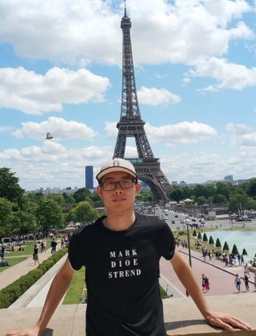

## 欢迎来到王崎的个人主页

王崎(1993.04-)，博士，贵州大学特聘教授，硕士生导师，研究方向：计算机视觉、大数据分析和理解、机器学习。博士在读期间曾在京东人工智能研究院担任算法工程师，而后成为广东省和比利时林堡省在国际教育合作方面的第一位联合培养博士研究生，并于2020年12月获得国内工学博士学位，2021年2月获得国外工程技术博士学位，是广东工业大学第一位获得双博士学位的毕业生。截至当前，累计发表9篇SCI论文，其中以第一作者发表行业内TOP期刊3篇, 曾多次获得了国际国内的知名科研竞赛奖项，发表了8项发明专利，参与了国家及省级课题5项。此外，还担任一些国际顶级会议和期刊的审稿人，如ACMMM (CCF A 会议), TNNLS (Top 期刊), Neurocomputing 等等。

邮箱：qiwang@gzu.edu.cn 

人生格言：Chance favors the prepared mind！

### 科研经历

2021.03 ~   至今 :   贵州大学，公共大数据国家重点实验室，特聘教授

2019.05 ~ 2021.02:  国外博士阶段，Hasselt University，导师：[Luc Claesen](https://www.uhasselt.be/fiche?voornaam=luc&naam=claesen#fiche)

2019.01 ~ 2019.04:  京东人工智能研究院，导师：[梅涛](http://taomei.me/), [刘武]()

2015.09 ~ 2020.12:  国内硕博阶段，广东工业大学，导师：[刘文印](http://www.wislab.cn/liuwy/cv.htm)，[雷亮](https://yzw.gdut.edu.cn/info/1124/4546.htm)

### 论文

1.	Qi Wang, Jinxiang Lai, Luc Claesen, et al., A Novel Feature Representation: Aggregating Convolution Kernels for Image Retrieval. Neural Networks, 2020. Doi: 10.1016/j.neunet.2020.06.010. (IF: 5.535, SCI 1/JCR 1, Top) 
2.	Qi Wang, Xinchen Liu, Wu Liu, Anan Liu, Wenyin Liu, Tao Mei. MetaSearch: Incremental Product Search via Deep Meta-learning.  IEEE Transactions on Image Processing, Doi:10.1109/TIP.2020.3004249. (IF: 9.34, SCI 1/JCR 1, Top) 
3.	Qi Wang, Jinxiang Lai, Zhenguo Yang, et al. Improving Cross-dimensional Weighting Pooling with Multi-scale Feature Fusion for Image Retrieval. 2019.8.  Neurocomputing, doi:10.1016/j. neucom.2019.08.25. (IF: 4.438, SCI 2/JCR 1, Top)
4.	Qi Wang, Jingxiang Lai, et al. Beauty Product Image Retrieval Based on Multi-Feature Fusion and Feature Aggregation. ACMMM Conference, 2018.10, doi:10.1145/3240508.3266431. (CCF A)
5.	Wang Qi, Lei Liang, Lai Jingxing, et al. Theory Research of Glare Reduction Based on the Fresnel Principle. Optik - International Journal for Light and Electron Optics, 2017, 145, doi:10.1016/j.ijleo.2017.07.005. (IF: 2.187, SCI 2/JCR 1) 
6.	Wang Qi, Lei Liang, Tan Ji, et al. Analysis and Verification of Eliminating Glare Based on Fresnel Polarization Reflection Theory. Acta Photonica Sinica, 2017, 46(7): 0715002.（EI）
7.	Zhenguo Yang, Qing Li, Haoran Xie, Wang Qi, Wenyin Liu. Learning Representation from Multiple Media Domains for Enhanced Event Discovery. Pattern Recognition, 2020. (SCI 1/JCR 1, Top)
8.	Xu Kai, Wang Qi, et al. Biomedical Named Entity Recognition Based on Dictionary Attention GRU network. Computer Applications and Software, 2019. (EI)
9.	K. Xu, Z. Yang, P. Kang, Q. Wang, and W. Liu. Document-Level Attention-Based BiLSTM-CRF Incorporating Disease Dictionary for Disease Named Entity Recognition. Computers in Biology and Medicine, vol. 108, pp. 122–132, 2019. (SCI 3)

### 招生意向

对人工智能、大数据方向感兴趣、且能吃苦耐劳的研究生。优秀者可推荐至腾讯优图、京东AI研究院等知名单位实习。对有读博意向的同学，非常优秀者可推荐至香港理工大学、比利时鲁汶大学等全球排名前100的知名高校读博，并辅助其申请留学生奖学金。

